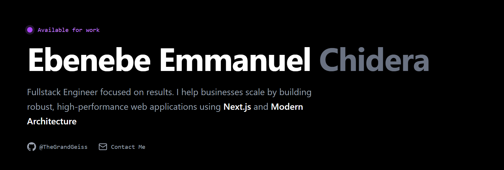

# Portfolio v1 ⚡




[](https://chidera-portfolio.vercel.app)
[](./LICENSE)

My personal digital garden and portfolio. A minimalist, high-performance single-page application built to showcase my work as a Fullstack Engineer. Designed with a focus on **SEO**, **accessibility**, and **smooth interactions**.

---

## 🛠️ Tech Stack

- **Framework:** [Next.js 15](https://nextjs.org/) (App Router)
- **Language:** TypeScript
- **Styling:** Tailwind CSS
- **Animations:** Framer Motion
- **Icons:** Lucide React
- **Fonts:** Inter & Space Grotesk (via `next/font`)
- **Deployment:** Vercel

---

## ✨ Features

- **⚡ Zero-Layout Shift:** Optimized font loading and structure.
- **🎨 Dark Mode:** sleek, high-contrast dark theme by default.
- **🔍 SEO Optimized:** Dynamic metadata, OpenGraph tags, and semantic HTML5.
- **📱 Fully Responsive:** Mobile-first approach using Tailwind breakpoints.
- **🎭 Micro-interactions:** subtle entrance animations using Framer Motion.

---

## 🚀 Getting Started

To run this project locally:

1. **Clone the repo**
   ```bash
   git clone [https://github.com/TheGrandGeiss/portfolio.git](https://github.com/TheGrandGeiss/portfolio.git)
   cd portfolio
Install dependencies

Bash

npm install
# or
pnpm install
Run the development server

Bash

npm run dev
Open your browser Navigate to http://localhost:3000.

📂 Project Structure
Bash

├── app/
│   ├── globals.css      # Tailwind directives & global styles
│   ├── layout.tsx       # Root layout & SEO Metadata
│   └── page.tsx         # Main landing page (Client Component)
├── public/              # Static assets (images, icons)
├── components/          # Reusable UI components (optional)
└── tailwind.config.ts   # Design system configuration
📬 Contact
Ebenebe Emmanuel Chidera Fullstack Engineer

GitHub: @TheGrandGeiss

Email: [Your Email Here]

Built with ❤️ in Nigeria.


